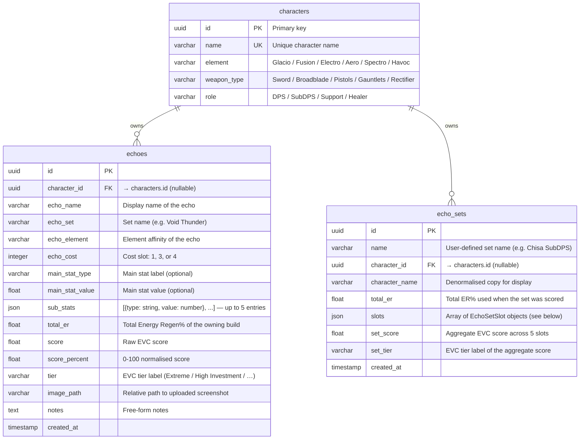

# Database Schema — Echoes Optimizer

## ERD (Entity Relationship Diagram)



---

## Table Details

### `characters`

| Column       | Type         | Constraints    | Notes                                |
|--------------|--------------|----------------|--------------------------------------|
| id           | UUID         | PK             | Auto-generated                       |
| name         | VARCHAR(100) | NOT NULL, UNIQUE |                                    |
| element      | VARCHAR(50)  | NOT NULL       | Glacio / Fusion / Electro / Aero / Spectro / Havoc |
| weapon_type  | VARCHAR(50)  | NOT NULL       | Sword / Broadblade / Pistols / Gauntlets / Rectifier |
| role         | VARCHAR(50)  | NOT NULL       | DPS / SubDPS / Support / Healer      |

---

### `echoes`

| Column           | Type         | Constraints | Notes                                      |
|------------------|--------------|-------------|--------------------------------------------|
| id               | UUID         | PK          |                                            |
| character_id     | UUID         | FK, nullable| References `characters.id`                 |
| echo_name        | VARCHAR(150) | NOT NULL    |                                            |
| echo_set         | VARCHAR(100) | nullable    | Set bonus name                             |
| echo_element     | VARCHAR(50)  | nullable    | Element chip shown on card                 |
| echo_cost        | INTEGER      | NOT NULL    | 1 / 3 / 4 — affects scoring weights       |
| main_stat_type   | VARCHAR(80)  | nullable    | Not used in scoring                        |
| main_stat_value  | FLOAT        | nullable    |                                            |
| sub_stats        | JSON         | NOT NULL    | `[{"type": "Crit Rate", "value": 8.1}, …]` up to 5 entries |
| total_er         | FLOAT        | nullable    | Build-level ER% context for EVC algorithm |
| score            | FLOAT        | nullable    | Raw EVC score                              |
| score_percent    | FLOAT        | nullable    | 0–100 normalised; drives tier label        |
| tier             | VARCHAR(50)  | nullable    | EVC label: Extreme / High Investment / Well Built / Decent / Base Level / Unbuilt |
| image_path       | VARCHAR(500) | nullable    | Relative path to uploaded screenshot       |
| notes            | TEXT         | nullable    |                                            |
| created_at       | TIMESTAMP    | NOT NULL    | UTC, default now()                         |

---

### `echo_sets`

| Column         | Type         | Constraints | Notes                                           |
|----------------|--------------|-------------|-------------------------------------------------|
| id             | UUID         | PK          |                                                 |
| name           | VARCHAR(100) | NOT NULL    | User-defined label                              |
| character_id   | UUID         | FK, nullable| References `characters.id`                      |
| character_name | VARCHAR(80)  | nullable    | Denormalised; copied from `characters.name`     |
| total_er       | FLOAT        | nullable    | Total ER% used when the set was scored          |
| slots          | JSON         | NOT NULL    | Array of `EchoSetSlot` objects (see below)      |
| set_score      | FLOAT        | nullable    | Aggregate score across all slots                |
| set_tier       | VARCHAR(50)  | nullable    | EVC tier label of the aggregate score           |
| created_at     | TIMESTAMP    | NOT NULL    | UTC, default now()                              |

#### `slots` JSON structure (per element)

```json
{
  "echo_id":      "uuid | null",
  "echo_name":    "string",
  "echo_cost":    4,
  "sub_stats":    [{"type": "Crit Rate", "value": 8.1}],
  "score":        42.3,
  "score_percent": 76.5,
  "tier":         "High Investment",
  "tier_label":   "High Investment"
}
```

---

## Tier Labels & Thresholds

| score_percent | Tier Label       | Colour token |
|---------------|------------------|--------------|
| ≥ 99          | Godly            | tier-S       |
| ≥ 88          | Extreme          | tier-S       |
| ≥ 77          | High Investment  | tier-A       |
| ≥ 66          | Well Built       | tier-B       |
| ≥ 55          | Decent           | tier-B       |
| ≥ 44          | Base Level       | tier-C       |
| < 44          | Unbuilt          | tier-D       |

---

## Scoring Algorithm — EVC Full Mode

Echoes are scored using the **EVC 3.2** algorithm:

1. All echoes in the set are sorted: echoes **with ER substat** processed first.
2. For each echo the algorithm computes how much of the build's ER requirement it satisfies (`er_net_av`, `er_net_ep`).
3. Remaining ER budget is carried forward to subsequent echoes (stateful).
4. Each substat is converted to an *Attack Value* (AV) equivalent using weight tables keyed by `(character_role, stat_type, echo_cost)`.
5. `score_percent = (raw_score / max_possible_score) * 100`.

> **Important:** scoring must be done for all 5 echoes in a single `/score/calculate-set` call — not individual `/score/calculate` calls per echo — because ER state is shared across the set.
